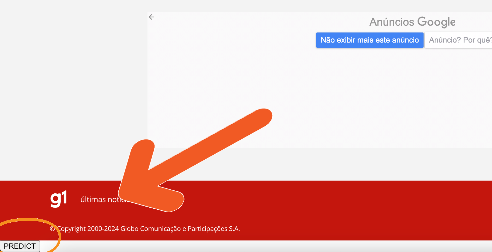
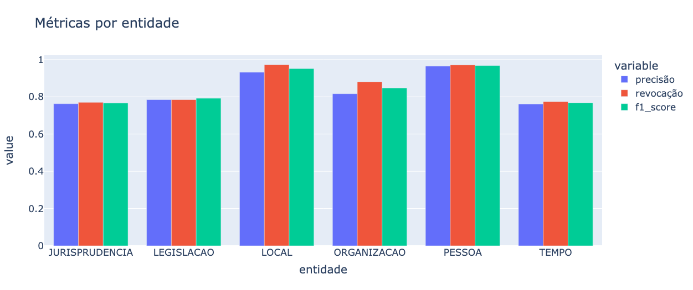
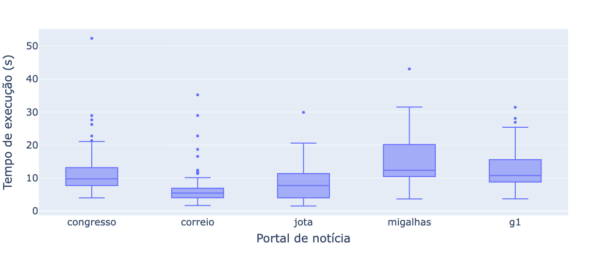
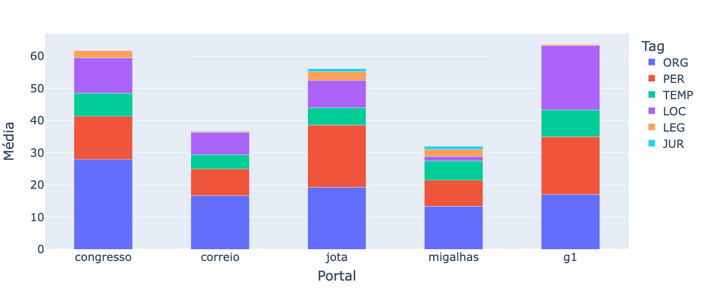
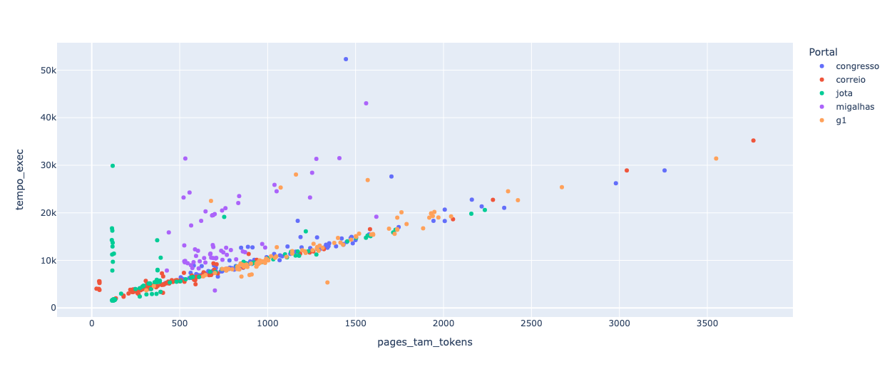

# Aplicação NER client-side 

## 💻 Descrição do Projeto
Este projeto, resultado da colaboração entre o Instituto de Computação (IComp) da Universidade Federal do Amazonas (UFAM) e a empresa JusBrasil, visa explorar a viabilidade de uma aplicação com arquitetura *client-side* para identificar e destacar entidades nomeadas em texto em português do domínio jurídico. Para alcançar esse objetivo, desenvolvemos uma extensão, que nada mais é do que um software adicionado ao navegador e executado exclusivamente no lado do cliente, para o navegador Google Chrome. Além disso, conduzimos testes e coletamos dados para poder entender melhor o funcionamento da extensão.

A identificação de entidades é realizada por meio do modelo de linguagem [BERTimbau](https://huggingface.co/neuralmind/bert-base-portuguese-cased), integrado à extensão. Este modelo foi submetido a ajustes finos com o conjunto de dados [LeNER-Br](https://huggingface.co/datasets/lener_br) para capacitar a identificação de entidades no contexto jurídico. No entanto, o modelo integrado à extensão pode ser trocado por outro modelo, bastando somente que o mesmo seja otimizado através da biblioteca [ONNX Runtime](https://onnxruntime.ai/). 

O funcionamento da extensão ocorre, basicamente, em três etapas:
  1. Extração do conteúdo textual da página;
  2. Utilização desse texto como entrada para o modelo, permitindo a identificação e classificação das entidades;
  3. Marcação das entidades nomeadas na página web, utilizando cores distintas.

🏁 Tabela de conteúdos
=================
<!--ts-->
   * 🔘 [Capturas de tela](#-capturas-de-tela)
   * 🔘 [Como usar](#-como-usar)
   * 🔘 [Tecnologias](#-tecnologias)
   * 🔘 [Experimentos e Resultados](#-experimentos-e-resultados)
<!--te-->

## 📸 Capturas de Tela

<p align="center">
  
</p>

<p align="center">
  
</p>

## 📖 Como usar

Para poder utilizar a aplicação, você vai precisar ter instalado na sua máquina o navegador [Google Chrome](https://www.google.com/chrome/dr/download/?brand=JJTC&ds_kid=43700077663103092&gad_source=1&gclid=CjwKCAjwoPOwBhAeEiwAJuXRh6_4khON9QuxjT_aLSf2ldXvHtRgmmkHRSgigPImGnzoPdRMuQf2uRoCfFQQAvD_BwE&gclsrc=aw.ds).

```bash
# Clone este repositório
$ https://github.com/gioandrade7/ner_extension.git
```

1. Acesse chrome://extensions/.
2. No canto superior direito, ative o Modo do desenvolvedor.
3. Clique em Carregar sem compactação.
4. Encontre e selecione a pasta *predict_extension_bert* do repositório clonado.
5. Acesse uma página web que contenha texto.
6. Clique na extensão para ativá-la.

## 🛠 Tecnologias
As seguintes ferramentas foram usadas na construção do projeto:

- [Tensorflow](https://www.tensorflow.org/)
- [Tensorflow.js](https://www.tensorflow.org/js)
- [Huggin Face](https://huggingface.co/)
- [Transformer.js](https://huggingface.co/docs/transformers.js/en/index)
- [Onnx Runtime](https://onnxruntime.ai/)
- [Selenium](https://www.selenium.dev/)

## 🔬 Experimentos e Resultados

### Experimentos
Na parte dos experimentos, foram coletados dados como: tempo de execução, quantidade de entidades por tipo extraídas e também o tamanho da página em palavras. Esses dados foram extraídos de 450 páginas dos seguintes portais de notícia: [Migalhas](https://www.migalhas.com.br/), [Congresso em Foco](https://congressoemfoco.uol.com.br/), [Correio Braziliense](https://www.correiobraziliense.com.br/), [Jota](https://www.jota.info/) e [G1](https://g1.globo.com/).

Para automatizar este experimento, utilizamos a biblioteca [Selenium](https://www.selenium.dev/) e criamos um script Python que ativa automaticamente a extensão nas páginas para coleta de dados. No entanto, a biblioteca tem acesso apenas ao DOM da página, o que impossibilitava o clique na extensão.

Para contornar essa limitação, desenvolvemos uma extensão adicional, localizada no diretório *predict_extension_auto*, criada especificamente para a execução dos experimentos. Esta extensão, assim como a original, marca as entidades, mas possui a vantagem de ser ativada por meio de um botão inserido na própria página web. Assim, o script consegue ativar a extensão através deste botão.

<p align="center">
  
</p>

### Resultados

No que diz respeito ao desempenho do modelo, ele alcançou um **f1-score** de 84%. O gráfico abaixo ilustra o desempenho do modelo por tipo de entidade, exibindo tanto o **f1-score**, quanto a **precisão** e a **revocação**.

<p align="center">
  
</p>

A análise do gráfico revela que o modelo demonstrou um desempenho notavelmente superior na identificação de entidades categorizadas como **LOCAL** e **PESSOA**.

Os gráficos seguintes estão intrinsecamente relacionados à extensão em questão.

O próximo gráfico, ilustra um *boxplot* para cada portal de notícia do tempo de execução da extensão. Observa-se que o tempo médio de execução da extensão variou entre 10 e 20 segundos.

<p align="center">
  
</p>

O gráfico de barras subsequente exibe a quantidade de cada tipo de entidade extraída em cada portal de notícias. A partir desta visualização, torna-se evidente que as entidades pertencentes ao domínio jurídico foram as menos identificadas pelo modelo.

<p align="center">
  
</p>

Por fim, o gráfico de dispersão abaixo estabelece uma correlação entre o tamanho das páginas, medido em palavras, e o tempo de execução da extensão. É perceptível um padrão quase linear entre essas duas variáveis, indicando que o tempo de execução aumenta proporcionalmente com o número de palavras.

<p align="center">
  
</p>


