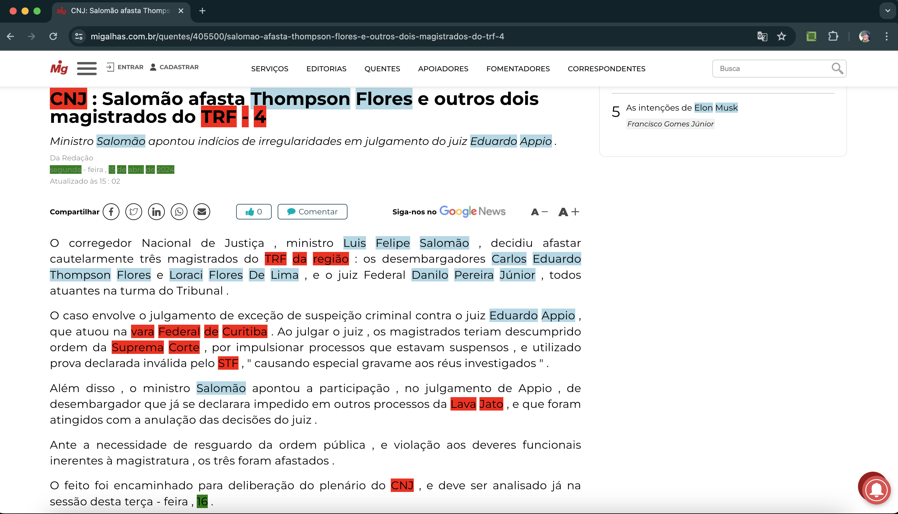

# Aplicação NER client-side 

## Descrição do Projeto
Este projeto foi desenvolvido pelo Instituto de Computação (IComp) da Universidade Federal do Amazonas (UFAM), em colaboração com a empresa JusBrasil. É dedicado a verificar a viabilidade de uma aplicação com arquitetura client-side, que possa identificar e destacar entidades nomeadas em texto.

<h4 align="center"> 
	✅  Aplicação NER client-side 🧩 Concluído ✅
</h4>

## Capturas de Tela

  

  

